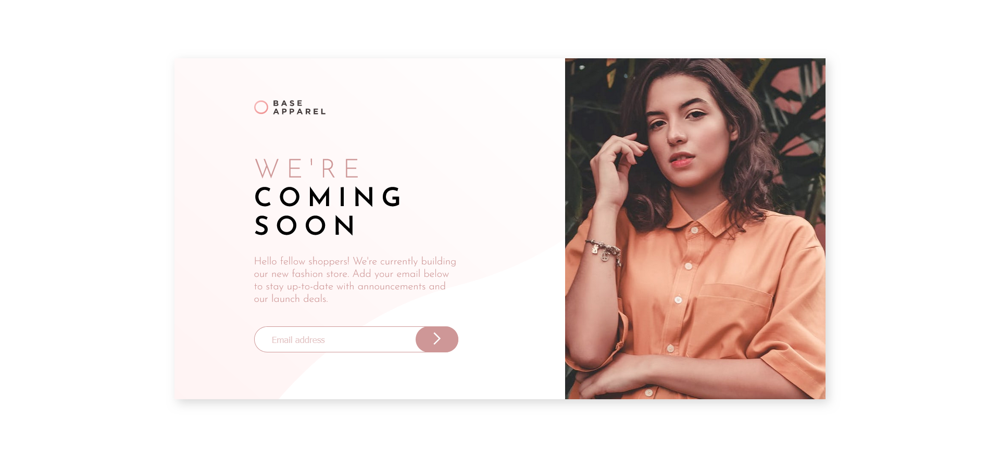

# Frontend Mentor - Base Apparel coming soon page solution

This is a solution to the [Base Apparel coming soon page challenge on Frontend Mentor](https://www.frontendmentor.io/challenges/base-apparel-coming-soon-page-5d46b47f8db8a7063f9331a0). Frontend Mentor challenges help you improve your coding skills by building realistic projects.

## Table of contents

- [Overview](#overview)
  - [The challenge](#the-challenge)
  - [Screenshot](#screenshot)
  - [Links](#links)
- [My process](#my-process)
  - [Built with](#built-with)
  - [What I learned](#what-i-learned)
  - [Author](#author)\*\*

## Overview

My challenge is to build out this coming soon page and get it looking as close to the design as possible.

### The challenge

Users should be able to:

- View the optimal layout for the site depending on their device's screen size
- See hover states for all interactive elements on the page
- Receive an error message when the `form` is submitted if:
  - The `input` field is empty
  - The email address is not formatted correctly

### Screenshot



### Links

- Solution URL: [Add solution URL here](https://your-solution-url.com)
- Live Site URL: [Add live site URL here](https://your-live-site-url.com)

### Built with

- Semantic HTML5 markup
- CSS custom properties
- CSS Grid
- Mobile-first workflow

### What I learned

The default browser validation bubbles or tooltips cannot be styled.I disabled them by adding novalidate attribute to the form element. I then created my own validation code using JS for the email input, and I added my own tooltips and validation information for the UI.

Also when using the html picture element, give the img element a class or classes, and add all styling to this/these classes. The styles will then be applied to whichever image the browser uses.

```html
<form novalidate>
  <input
    type="email"
    name="email"
    class="form-section__email-input"
    placeholder="Email address"
    required
  />
  <button type="submit" class="form-section__submit-button">
    
  </button>
  <p class="form-section__validation-error v-hidden">
    Please provide a valid email
  </p>
</form>
```

```js
submitButton.addEventListener("click", (e) => {
  const email = emailInput.value;
  if (
    email == "null" ||
    email.startsWith("@") ||
    email.endsWith("@") ||
    !email.includes("@") ||
    !email.includes(".") ||
    email.startsWith(".") ||
    email.endsWith(".")
  ) {
    e.preventDefault();
    errorMessage.classList.remove("v-hidden");
    emailInput.style.backgroundImage = "url('./images/icon-error.svg')";
    emailInput.style.backgroundRepeat = "no-repeat";
    emailInput.style.backgroundPosition = "75% 50%";
  }
});
```

## Author

- Name - Paul Ryan
- Frontend Mentor - https://www.frontendmentor.io/profile/Gunner40
